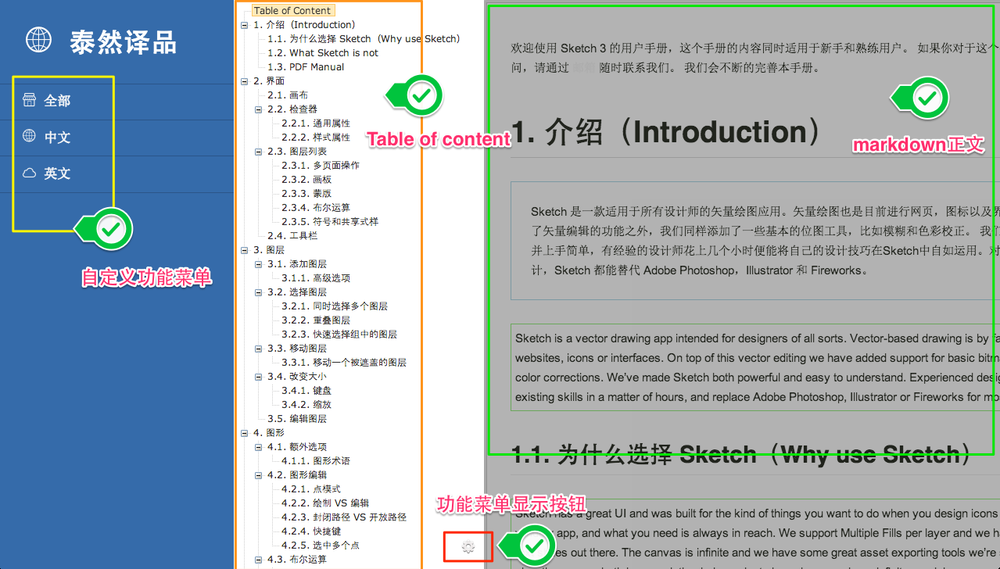

# Trans is a ruby gem

trans 是一个ruby gem，用于把markdown文件生成带有toc目录的html文档。此gem可以用于翻译

根据h1到h6标题生成toc内容大纲，采用的jquery插件[i5ting_ztree_toc](https://github.com/i5ting/i5ting_ztree_toc)。

显示中文和英文

只显示英文

## Markdown生成步骤

1. 生成.toc目录，把template.html拷贝进去
1. 生成preview目录
1. 编译markdown到preview目录
1. 读取路径，将css和js举例增加到template中

## 安装方法

	gem intall trans
	
## 命令概览

- trans 

		把用到的资源文件放到gem目录下，没有放到preview目录下使用方便，但是当你本地，可以节省空间，避免多次copy
 
## 用法

指定单个文件

	trans -f sample.md
	
指定目录

	trans -d .

### guide

- [新手指南](https://github.com/i5ting/trans-cli/blob/master/doc/guide.md)

## Test  in development mode

	./generate.sh
	
or

	ruby -Ilib bin/trans -f data/sample.md  
	
## History

- 0.5.8
	- 使用压缩后的js，并在tmpl里增加了gulp构建
- 0.5.7
	- menu不只是可以状态，还支持url
	- example : 'zh':{'icon':'icon-edit','href':'http://baidu.com','target':'_blank','display':"中文"}
- 0.5.6
	- 'fix title update issue'
- 0.5.5
	- if toc_conf file exst,not replace
- 0.5.3
	- 必须把template放到git里，不然gem不包括
- 0.5.2
	- 修正scroll事件绑定的位置问题
- 0.5.1
	- refact
- 0.5.0
	- rename it to trans gem
- 0.4.1
	- 不在生成toc_conf.js,而是直接使用toc/toc_conf.js
- 0.4.0
	- 正式支持翻译英文文档
- 0.3.2
	- 修正依赖问题，之前忘记加了，以为放到gemfile就可以呢，反思
- 0.3.1
	- 修正创建toc_conf.js时shell问题
- v0.3.0
	- 增加了tocmd_conf命令，把用到的资源文件放到src目录下,增加`.toc_conf`
- v0.2.0
	- 增加了tocmd_local命令，把用到的资源文件放到preview目录下
- v0.1.6
	- 去掉了autolink
- v0.1.5
	- 重构代码命名,把测试一道sample.md中
- v0.1.4
	- 增加table支持

## 欢迎fork和反馈

在issue提问或邮件shiren1118@126.com

## License

this gem is released under the [MIT License](http://www.opensource.org/licenses/MIT)